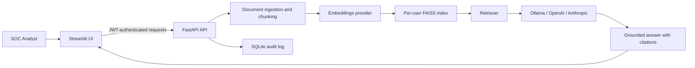

# SecureAI SOC Copilot


SecureAI SOC Copilot is a secure GenAI assistant for SOC analysts that performs grounded retrieval over security logs and reports. It combines a FastAPI backend, a Streamlit analyst interface, LangChain retrieval, FAISS vector search, JWT authentication, and audit logging into a local-first workflow that can run with Ollama or hosted model providers.

## Overview

This project is designed around a practical security use case: analysts need fast answers, but they also need evidence-backed output, access control, and an audit trail. SecureAI SOC Copilot focuses on secure ingestion, grounded retrieval, and explainable responses instead of generic chat behavior.

The current implementation supports `.txt`, `.log`, and text-based `.pdf` evidence, builds per-user vector indexes, and answers questions with citations and retrieved source excerpts. Inference can be routed to local Ollama models or to OpenAI and Anthropic-compatible APIs.

## Architecture Diagram



## Features

- Secure GenAI workflow for SOC-style investigation over uploaded evidence
- FastAPI backend with Streamlit frontend for a clean analyst experience
- LangChain-based chunking and retrieval pipeline
- FAISS vector storage with per-user index isolation
- JWT authentication for protected upload and chat flows
- Audit logging that records prompts, evidence references, status, and summaries
- Local Ollama inference support for privacy-sensitive environments
- OpenAI and Anthropic-compatible hosted inference support
- Prompt injection guard layer before generation
- Source citations and exact supporting snippets in answers
- Docker Compose support for end-to-end local deployment

## Tech Stack

| Layer | Technologies |
| --- | --- |
| Frontend | Streamlit |
| Backend | FastAPI, Pydantic, Uvicorn |
| LLM and retrieval | LangChain, FAISS, Ollama, OpenAI, Anthropic |
| Security | JWT auth, prompt injection guard, SHA-256 file metadata, audit logging |
| Storage | SQLite, local file storage |
| Dev workflow | Docker Compose, pytest, Ruff, GitHub Actions, CodeQL |

## Project Structure

```text
.
|-- backend
|   |-- app
|   |   |-- api
|   |   |-- core
|   |   |-- services
|   |   |-- dependencies.py
|   |   |-- main.py
|   |   `-- schemas.py
|   |-- tests
|   |-- Dockerfile
|   |-- requirements.txt
|   `-- requirements-dev.txt
|-- frontend
|   |-- app.py
|   |-- Dockerfile
|   `-- requirements.txt
|-- docs
|-- sample-security-incident.log
|-- docker-compose.yml
`-- .env.example
```

## Installation

### Option 1: Docker

```bash
cp .env.example .env
docker compose up --build -d
```

### Option 2: Local Python environment

```bash
cp .env.example .env
python3 -m venv .venv
source .venv/bin/activate
pip install -r backend/requirements-dev.txt
pip install -r frontend/requirements.txt
```

For local inference, install Ollama and pull the configured models:

```bash
ollama pull deepseek-r1:1.5b
ollama pull nomic-embed-text
```

## Quick Start

### Docker workflow

```bash
cp .env.example .env
docker compose up --build -d
```

Open:

- Streamlit UI: `http://localhost:8501`
- FastAPI docs: `http://localhost:8000/docs`

### Local workflow

Start the API:

```bash
PYTHONPATH=backend uvicorn app.main:app --reload --port 8000
```

Start the frontend in a second terminal:

```bash
streamlit run frontend/app.py
```

### Demo flow

1. Sign in with the configured demo credentials from `.env`.
2. Upload `sample-security-incident.log` or your own log/report file.
3. Wait for chunking and vector indexing to complete.
4. Ask grounded questions such as:
   - `Summarize the incident using only the uploaded evidence.`
   - `Which source IP triggered the compromise?`
   - `What evidence suggests privilege escalation or exfiltration?`
5. Expand the returned citations to inspect the exact source excerpts.

## Screenshots

Screenshots can be added here to show:

- Analyst login flow
- Evidence upload and indexing
- Grounded chat responses with citations
- Audit log review

Placeholder:

```text
docs/screenshots/
|-- login.png
|-- upload.png
|-- grounded-chat.png
`-- audit-log.png
```

## Future Roadmap

- Role-based access control beyond a single demo account
- Async ingestion for larger evidence sets
- OCR support for scanned PDFs
- Hybrid search and reranking
- Retrieval evaluation and response quality benchmarks
- Centralized audit storage and stronger retention controls
- Malware scanning and deeper content inspection
- Hardened deployment with TLS, secrets management, and rate limiting

## Security Notes

- This repository is an MVP and currently uses an environment-configured demo user.
- FAISS indexes are isolated per authenticated user, but production use should add stronger identity and storage controls.
- The prompt injection guard is intentionally lightweight and should be expanded for real-world deployments.
- Do not commit `.env`, uploaded evidence, local vector stores, or the SQLite database.

See [SECURITY.md](SECURITY.md) for vulnerability reporting and deployment assumptions.

## License

This project is licensed under the [MIT License](LICENSE).
